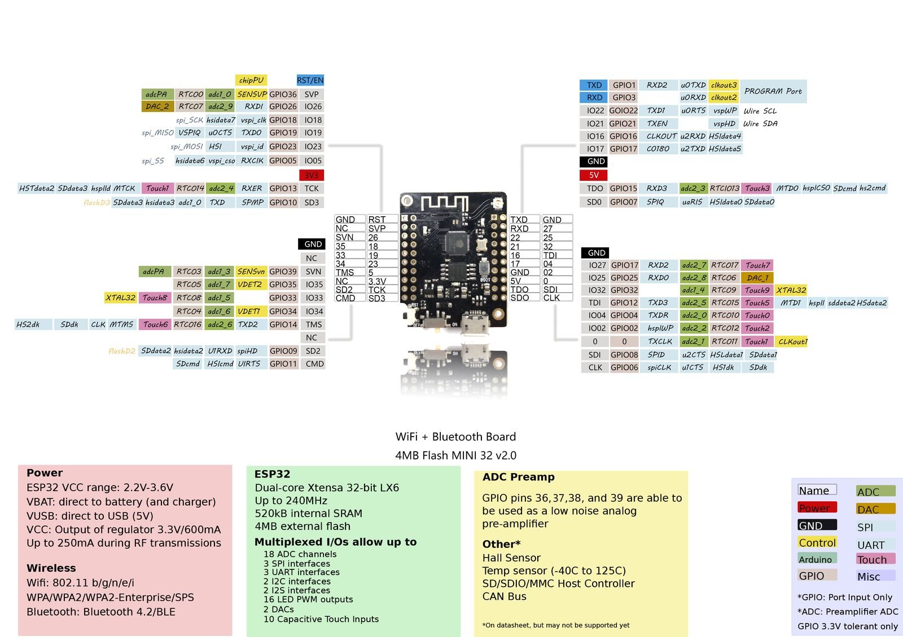
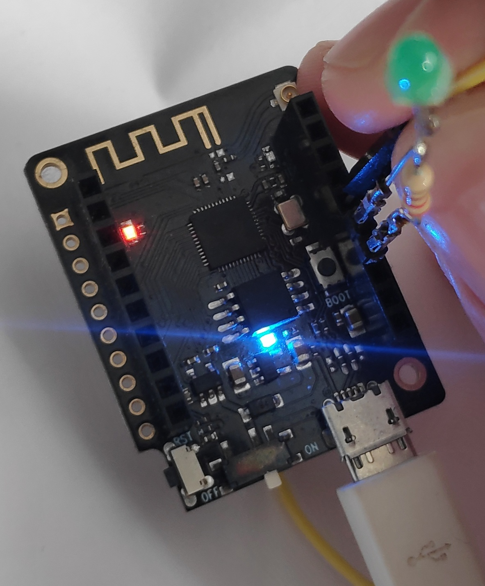
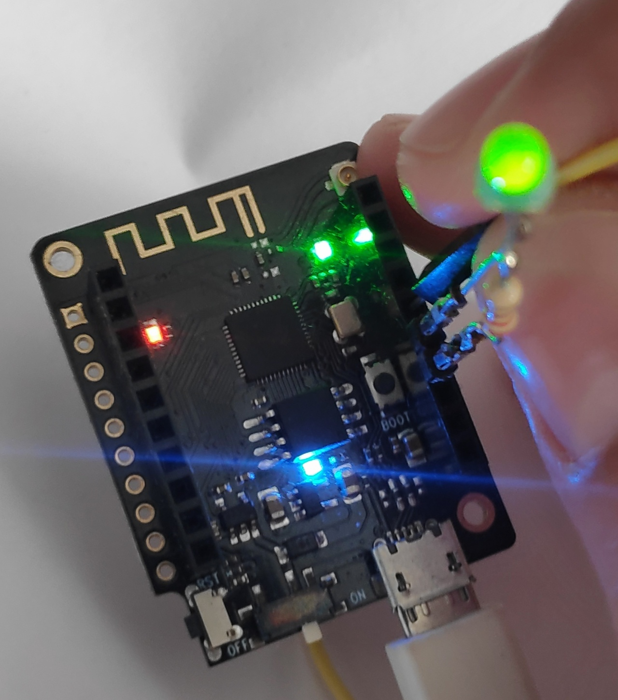
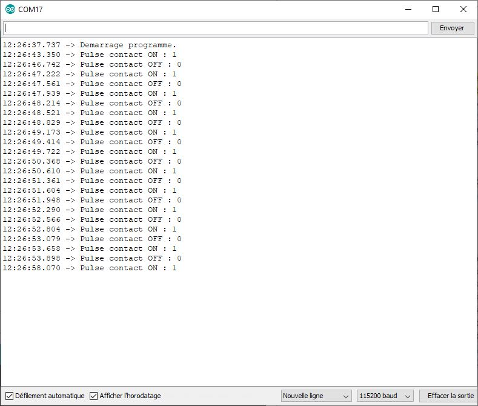

# arduino_pulse_switch
Arduino code for generate pulse when switch commute ON or OFF.

# information connection dev board ESP32 mini32
## INPUT OUTPUT
For the configuration we can connect these wires :
 1. For external led or external command (output) connect LED on the pin D4 (GPIO 16).
 2. For follow the switch status connect switch wire on the pin D3 (GPIO 17)
 
WARNING : **There are in inversion between D3 and D4 between the image on the esp32 mini32 and the datasheet.**

# Test code

For this test, we connect a wire on D3 (GPIO 17) and swith GND or disconnect for emulate the switch.
For observe the output, we connect a led on D4 (GPIO 16) and observe pulse light when we connect and disconnect the wire on D3.

